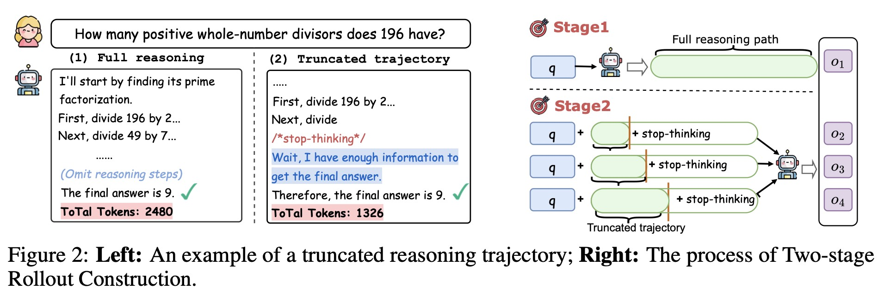
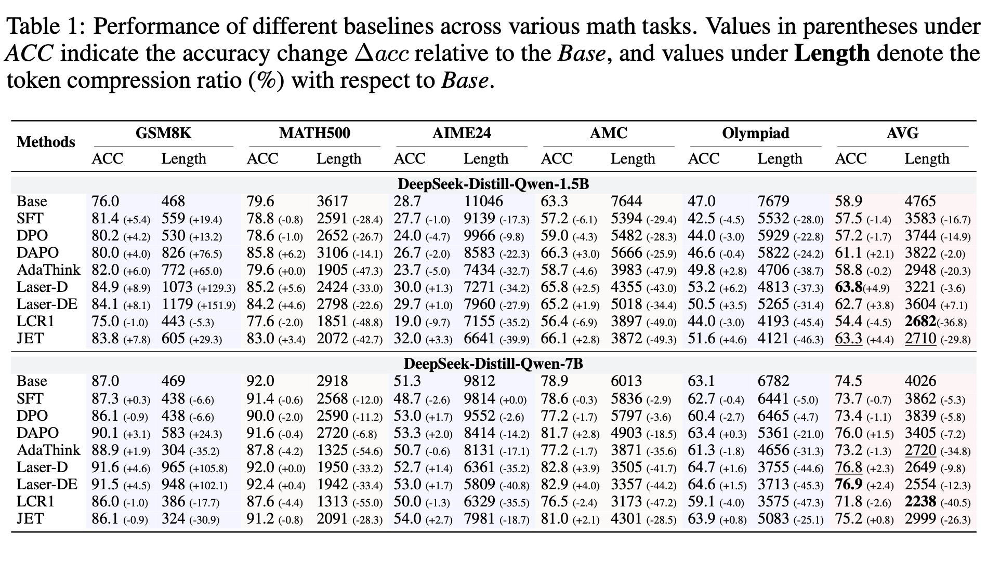

<h1 align="center">Your Models Have Thought Enough: Training Large Reasoning Models to Stop Overthinking</h1>

<div align="center"> 

[](pics/JET.pdf)
[]() 

</div>

# Introduce
JET is a RL method that trains models to **proactively terminate unnecessary thinking**. JET operates through two key components. 

- it additionally performs trajectory truncation during RL rollout, exposing the model to reasoning paths of varying lengths while keeping them aligned with the model’s natural generation. 
- introduce a quality-controlled length reward to better guide the model toward efficiency. This reward identifies the shortest correct trajectory in each reasoning group as a baseline and assigns length penalties to longer correct trajectories. 
 
<div align=center>

</div>

# Requirements
 
```bash
#create the running environment
conda env create -f environment/verl_env.yaml
conda activate verl_env
````

# QuickStart

```bash
# step1: Training
conda activate verl_env
cd EasyR1/examples
bash run.sh

# step2: Merge the checkpoint
conda activate verl_env
python scripts/model_merger.py --local_dir your_ckp_path/global_step_70/actor
````

# Datasets
We provide training and test datasets for JET.
- Training data: data/training/training_cleaned.json
- Test data path: data/test

# Main Results
<div align=center>

</div>

# Acknowledgement
We thank the [VeRL](https://github.com/volcengine/verl) for providing the awaresome open-source RL infrastructure.

# Models
We will release our models soon [🤗HuggingFace](https://huggingface.co/).