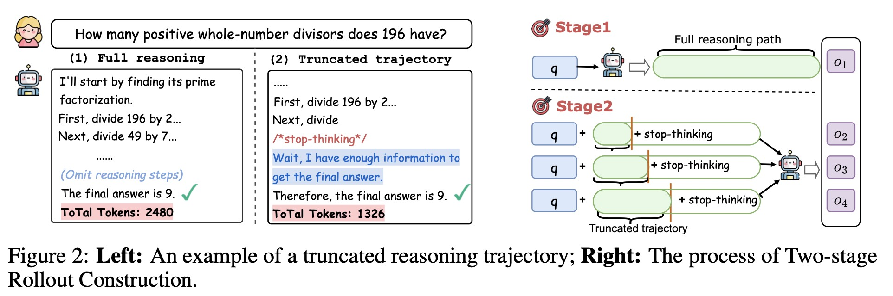
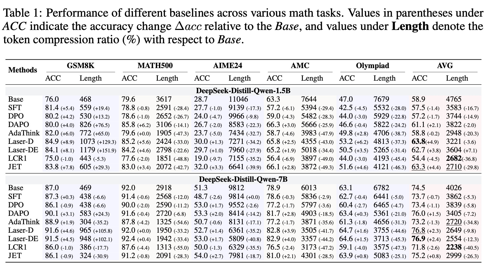

<div align="center">
  <h1>Your Models Have Thought Enough: Training Large Reasoning Models to Stop Overthinking</h1>

  <div style="margin: 20px 0;">
    <a href="https://openreview.net/forum?id=your_paper_id" target="_blank">
      
    </a>
    <a href="pics/JET.pdf" target="_blank">
      
    </a>
    <a href="https://huggingface.co/JinyiHan/JET-7B" target="_blank">
      
    </a>
    <a href="https://huggingface.co/JinyiHan/JET-1.5B" target="_blank">
      
    </a>
  </div>

</div>

## 📢 Latest News

- **2026-02**: Our paper "Your Models Have Thought Enough: Training Large Reasoning Models to Stop Overthinking" has been accepted by **ICLR 2026**! 🎉

## 📖 Background

JET (Just-Enough-Think) is an innovative reinforcement learning (RL) method that trains large language models to **proactively terminate unnecessary thinking** while maintaining reasoning accuracy. JET addresses the critical issue of overthinking in large reasoning models through two key components:

### Key Innovations

1. **Trajectory Truncation**: During RL rollout, JET dynamically truncates reasoning trajectories to expose the model to paths of varying lengths, ensuring alignment with natural generation patterns.

2. **Quality-Controlled Length Reward**: A novel reward mechanism that identifies the shortest correct trajectory as a baseline and penalizes longer correct reasoning paths, effectively guiding the model towards efficient reasoning.

<div align="center">
  
  <p style="margin-top: 10px; color: #666; font-size: 0.9em;">JET Training Process Overview</p>
</div>

## 🚀 QuickStart

### Prerequisites

This repository is built on top of [VeRL](https://github.com/volcengine/verl) and [Lighteval](https://github.com/huggingface/lighteval), requiring two separate conda environments.

```bash
# Create and activate training environment
conda env create -f environment/verl_env.yaml
conda activate verl_env

# Create and activate evaluation environment (optional)
conda env create -f environment/lighteval_env.yaml
conda activate lighteval_env
```

### Training

```bash
# Step 1: Start training
conda activate verl_env
cd Just-Enough-Think/EasyR1/examples
bash run.sh

# Step 2: Merge checkpoints after training completes
conda activate verl_env
cd Just-Enough-Think/EasyR1/
python scripts/model_merger.py --local_dir your_ckp_path/global_step_70/actor
```

### Evaluation

```bash
# Step 3: Evaluate the trained model
conda activate lighteval_env
cd Just-Enough-Think
bash eval/eval.sh
```

## 📊 Datasets

We provide comprehensive training and testing datasets:

- **Training Data**: `data/training/training_cleaned.json`
- **Test Data**: `data/test/`

## 📈 Main Results

<div align="center">
  
  <p style="margin-top: 10px; color: #666; font-size: 0.9em;">Performance Comparison on Reasoning Tasks</p>
</div>


## 🙏 Acknowledgement

We thank the [VeRL](https://github.com/volcengine/verl) team for providing the excellent open-source RL infrastructure that served as the foundation for our work.

## 📚 Citations

If you find our work useful, please consider citing our paper:

```bibtex
@misc{han-JET,
      title={Your Models Have Thought Enough: Training Large Reasoning Models to Stop Overthinking}, 
      author={Jinyi Han and Ying Huang and Ying Liao and Zishang Jiang and Xikun Lu and Haiquan Zhao and Xinyi Wang and Guanghao Zhou and Sihang Jiang and Jiaqing Liang and Weikang Zhou and Zeye Sun and Fei Yu and Yanghua Xiao},
      year={2025},
      eprint={2509.23392},
      archivePrefix={arXiv},
      primaryClass={cs.AI},
      url={https://arxiv.org/abs/2509.23392}, 
}
```